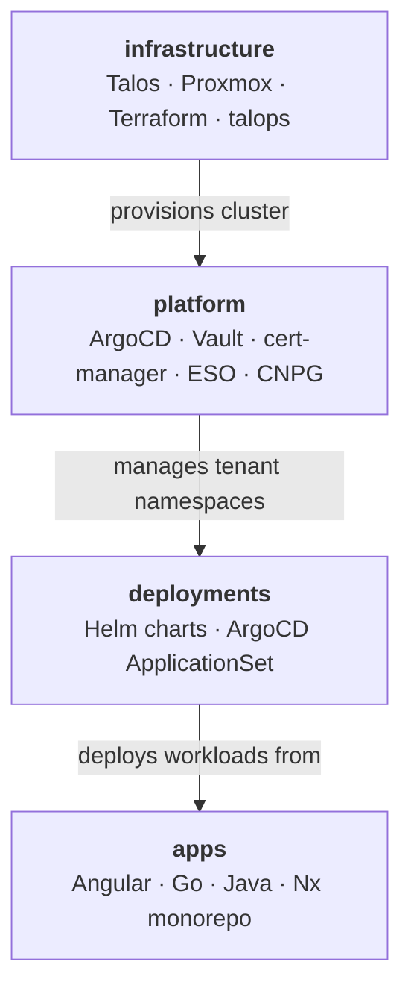

# jdwlabs

Self-hosted platform engineering lab: production K8s infrastructure, real app workloads, and a living portfolio of GitOps & full-stack practices.

![Talos](https://img.shields.io/badge/Talos-FF7300?logoSvg=%3Csvg%20width%3D%2234%22%20height%3D%2234%22%20viewBox%3D%220%200%2034%2034%22%20fill%3D%22none%22%20xmlns%3D%22http%3A%2F%2Fwww.w3.org%2F2000%2Fsvg%22%3E%3Cpath%20d%3D%22M16.589%200C16.1974%200%2015.7896%200.0161943%2015.3063%200.0530005C15.1527%200.0647798%2015.033%200.192864%2015.033%200.345979V33.654C15.033%2033.8086%2015.1527%2033.9367%2015.3063%2033.947C15.7925%2033.9838%2016.2004%2034%2016.5919%2034C16.9836%2034%2017.3885%2033.9838%2017.8717%2033.947C18.0254%2033.9352%2018.1451%2033.8072%2018.1451%2033.654V0.345979C18.1451%200.191393%2018.0254%200.0633064%2017.8717%200.0530005C17.3885%200.0176677%2016.9836%200%2016.595%200H16.589Z%22%20fill%3D%22white%22%2F%3E%3Cpath%20d%3D%22M31.5784%207.2214C31.5015%207.2214%2031.4262%207.25084%2031.3715%207.30531C31.2267%207.44661%2031.0819%207.59091%2030.9356%207.7367C27.1142%2011.5689%2025.2463%2014.6032%2025.2241%2017.0133C25.202%2019.4131%2027.0802%2022.4797%2030.9666%2026.39C31.0789%2026.5033%2031.1897%2026.6138%2031.302%2026.7227L31.3301%2026.7507C31.3863%2026.8052%2031.4602%2026.8361%2031.5385%2026.8361C31.5473%2026.8361%2031.5562%2026.8361%2031.5651%2026.8361C31.6523%2026.8287%2031.7306%2026.7831%2031.7808%2026.7109C32.2907%2025.9822%2032.7429%2025.2181%2033.1241%2024.4393C33.1788%2024.3274%2033.1566%2024.1934%2033.0695%2024.1036C30.0061%2020.9883%2028.3259%2018.4811%2028.3392%2017.0427C28.3525%2015.5675%2030.0445%2013.0529%2033.1019%209.96268C33.1891%209.87435%2033.2113%209.74039%2033.1581%209.62853C32.7813%208.85115%2032.332%208.08411%2031.8237%207.34951C31.7734%207.27736%2031.6952%207.23173%2031.6079%207.22432C31.5991%207.22432%2031.5888%207.22432%2031.5799%207.22432L31.5784%207.2214Z%22%20fill%3D%22white%22%2F%3E%3Cpath%20d%3D%22M24.5627%201.70171C24.5287%201.70171%2024.4947%201.7076%2024.4621%201.71938C24.3868%201.74588%2024.3262%201.8033%2024.2923%201.87544C21.7593%207.48911%2020.1221%2013.4355%2020.1221%2017.0277C20.1221%2020.7967%2021.6914%2026.7534%2024.1208%2032.2051C24.1534%2032.2773%2024.2139%2032.3347%2024.2878%2032.3612C24.3203%2032.373%2024.3558%2032.3789%2024.3898%2032.3789C24.4326%2032.3789%2024.4769%2032.3685%2024.5169%2032.3509C25.306%2031.9754%2026.0759%2031.5338%2026.8029%2031.0376C26.9197%2030.9582%2026.964%2030.8065%2026.9064%2030.677C24.675%2025.5933%2023.2342%2020.2343%2023.2342%2017.0263C23.2342%2013.8183%2024.7252%208.57269%2027.032%203.41099C27.0896%203.28143%2027.0467%203.12979%2026.9315%203.05028C26.2148%202.55266%2025.4611%202.10805%2024.6912%201.73263C24.6498%201.71201%2024.6055%201.70318%2024.5612%201.70318L24.5627%201.70171Z%22%20fill%3D%22white%22%2F%3E%3Cpath%20d%3D%22M8.61665%201.70462C8.57235%201.70462%208.52798%201.71493%208.48662%201.73554C7.71672%202.11244%206.96306%202.55705%206.24638%203.05467C6.12964%203.13564%206.08826%203.28728%206.14589%203.41538C8.4512%208.57704%209.9407%2013.9198%209.9407%2017.0277C9.9407%2020.1356%208.49993%2025.5918%206.27003%2030.6754C6.21387%2030.805%206.25672%2030.9567%206.37347%2031.0362C7.09458%2031.5279%207.85418%2031.9651%208.62852%2032.3361C8.66838%2032.3553%208.71275%2032.3656%208.75704%2032.3656C8.79103%2032.3656%208.82653%2032.3597%208.85902%2032.3479C8.93437%2032.3199%208.99498%2032.264%209.02747%2032.1904C11.4746%2026.6856%2013.0558%2020.7348%2013.0558%2017.0292C13.0558%2013.3236%2011.42%207.49204%208.88714%201.87982C8.85458%201.80769%208.79254%201.75027%208.71718%201.72377C8.68463%201.71199%208.65064%201.70609%208.61665%201.70609V1.70462Z%22%20fill%3D%22white%22%2F%3E%3Cpath%20d%3D%22M1.57981%207.22269C1.49263%207.23153%201.4143%207.27716%201.36406%207.34781C0.854239%208.08248%200.405008%208.84952%200.0296617%209.62683C-0.0250147%209.73876%20-0.00284865%209.87272%200.0858157%209.96105C3.14327%2013.0513%204.83528%2015.5659%204.84858%2017.0411C4.86779%2019.1213%201.23106%2022.9669%200.11537%2024.0961C0.0281839%2024.1844%200.00601781%2024.3199%200.0606942%2024.4317C0.441952%2025.212%200.894141%2025.9776%201.40692%2026.7093C1.45716%2026.78%201.53548%2026.8256%201.62267%2026.8344C1.63154%2026.8344%201.6404%2026.8344%201.64927%2026.8344C1.72611%2026.8344%201.80147%2026.8035%201.85763%2026.749L1.87684%2026.7299C1.99063%2026.6166%202.10589%2026.5032%202.22115%2026.3884C6.10761%2022.4781%207.98585%2019.4113%207.96367%2017.0116C7.94148%2014.6016%206.07215%2011.5673%202.25218%207.735C2.10737%207.58928%201.96107%207.44648%201.81625%207.30368C1.7601%207.24921%201.68621%207.21976%201.60937%207.21976C1.6005%207.21976%201.59015%207.21976%201.58129%207.21976L1.57981%207.22269Z%22%20fill%3D%22white%22%2F%3E%3C%2Fsvg%3E)

---

## The Stack

## Repositories

| Repo | Description |
|------|-------------|
| [infrastructure](https://github.com/jdwlabs/infrastructure) | Talos Kubernetes cluster provisioning on Proxmox via Terraform and the `talops` CLI |
| [platform](https://github.com/jdwlabs/platform) | Tenant-centric GitOps platform — ArgoCD, Vault, cert-manager, ESO, and CNPG |
| [deployments](https://github.com/jdwlabs/deployments) | Helm charts and ArgoCD ApplicationSet configs for the jdwlabs tenant |
| [apps](https://github.com/jdwlabs/apps) | Multi-language Nx monorepo — Angular frontends, Go services, Java Spring Boot backends |

---

**Maintainer:** [Jake Willmsen](https://github.com/jdwillmsen)
