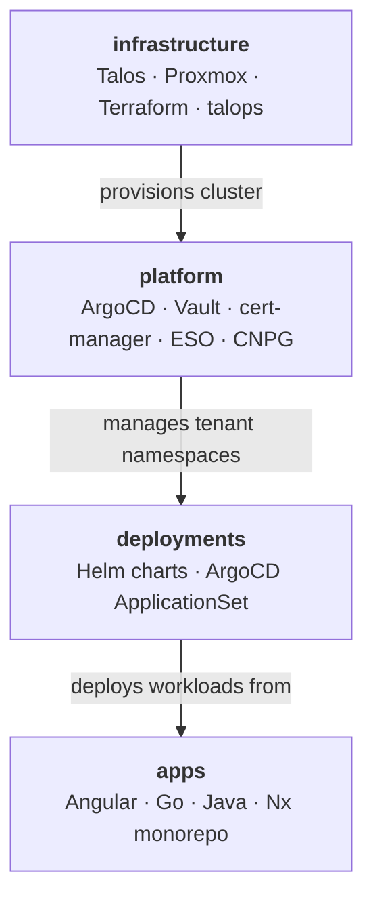

# jdwlabs

Self-hosted platform engineering lab: production K8s infrastructure, real app workloads, and a living portfolio of GitOps & full-stack practices.

---

## The Stack

## Repositories

| Repo | Description |
|------|-------------|
| [infrastructure](https://github.com/jdwlabs/infrastructure) | Talos Kubernetes cluster provisioning on Proxmox via Terraform and the `talops` CLI |
| [platform](https://github.com/jdwlabs/platform) | Tenant-centric GitOps platform — ArgoCD, Vault, cert-manager, ESO, and CNPG |
| [deployments](https://github.com/jdwlabs/deployments) | Helm charts and ArgoCD ApplicationSet configs for the jdwlabs tenant |
| [apps](https://github.com/jdwlabs/apps) | Multi-language Nx monorepo — Angular frontends, Go services, Java Spring Boot backends |

---

**Maintainer:** [Jake Willmsen](https://github.com/jdwillmsen)
