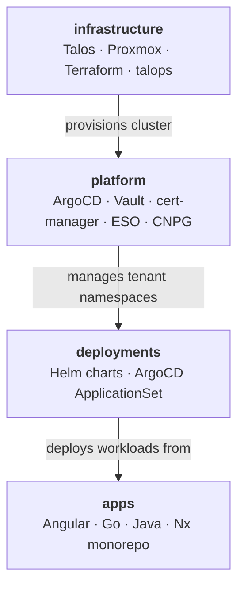

# jdwlabs

Self-hosted platform engineering lab: production K8s infrastructure, real app workloads, and a living portfolio of GitOps & full-stack practices.

---

## Mission

This isn't a tutorial cluster — it's a real platform run to the standard a paying customer's workloads would need: bare-metal provisioning, GitOps delivery, and application services, built and operated with the same rigor as a production shop. The goal is a working system, not a diagram of one.

**What "done" means here:**

- Every change ships through a reviewed, green-CI pull request — no direct pushes to `main`.
- A GitOps change isn't done at green CI; it's done when ArgoCD reports the workload **Synced + Healthy** against the live cluster.
- Docs are code: paths and structure claimed in a README must resolve in the repo, or it's a bug, not a typo to shrug off.

The [org-wide code standards](https://github.com/jdwlabs/.github/blob/main/docs/code-standards.md) spell out the full contract this repo map exists to enforce.

---

## The Stack

## Repositories

| Repo | Description |
|------|-------------|
| [infrastructure](https://github.com/jdwlabs/infrastructure) | Talos Kubernetes cluster provisioning on Proxmox via Terraform and the `talops` CLI |
| [platform](https://github.com/jdwlabs/platform) | Tenant-centric GitOps platform — ArgoCD, Vault, cert-manager, ESO, and CNPG |
| [deployments](https://github.com/jdwlabs/deployments) | Helm charts and ArgoCD ApplicationSet configs for the jdwlabs tenant |
| [apps](https://github.com/jdwlabs/apps) | Multi-language Nx monorepo — Angular frontends, Go services, Java Spring Boot backends |

---

**Maintainer:** [Jake Willmsen](https://github.com/jdwillmsen)
