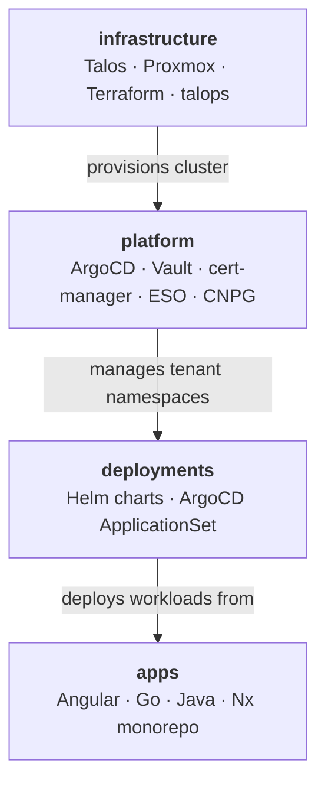

# jdwlabs

Self-hosted platform engineering lab: production K8s infrastructure, real app workloads, and a living portfolio of GitOps & full-stack practices.

![Talos](https://img.shields.io/badge/Talos-FF7300?logo=data:image/svg%2Bxml;base64,PHN2ZyB3aWR0aD0iMzQiIGhlaWdodD0iMzQiIHZpZXdCb3g9IjAgMCAzNCAzNCIgZmlsbD0ibm9uZSIgeG1sbnM9Imh0dHA6Ly93d3cudzMub3JnLzIwMDAvc3ZnIj48cGF0aCBkPSJNMTYuNTg5IDBDMTYuMTk3NCAwIDE1Ljc4OTYgMC4wMTYxOTQzIDE1LjMwNjMgMC4wNTMwMDA1QzE1LjE1MjcgMC4wNjQ3Nzk4IDE1LjAzMyAwLjE5Mjg2NCAxNS4wMzMgMC4zNDU5NzlWMzMuNjU0QzE1LjAzMyAzMy44MDg2IDE1LjE1MjcgMzMuOTM2NyAxNS4zMDYzIDMzLjk0N0MxNS43OTI1IDMzLjk4MzggMTYuMjAwNCAzNCAxNi41OTE5IDM0QzE2Ljk4MzYgMzQgMTcuMzg4NSAzMy45ODM4IDE3Ljg3MTcgMzMuOTQ3QzE4LjAyNTQgMzMuOTM1MiAxOC4xNDUxIDMzLjgwNzIgMTguMTQ1MSAzMy42NTRWMC4zNDU5NzlDMTguMTQ1MSAwLjE5MTM5MyAxOC4wMjU0IDAuMDYzMzA2NCAxNy44NzE3IDAuMDUzMDAwNUMxNy4zODg1IDAuMDE3NjY3NyAxNi45ODM2IDAgMTYuNTk1IDBIMTYuNTg5WiIgZmlsbD0id2hpdGUiLz48cGF0aCBkPSJNMzEuNTc4NCA3LjIyMTRDMzEuNTAxNSA3LjIyMTQgMzEuNDI2MiA3LjI1MDg0IDMxLjM3MTUgNy4zMDUzMUMzMS4yMjY3IDcuNDQ2NjEgMzEuMDgxOSA3LjU5MDkxIDMwLjkzNTYgNy43MzY3QzI3LjExNDIgMTEuNTY4OSAyNS4yNDYzIDE0LjYwMzIgMjUuMjI0MSAxNy4wMTMzQzI1LjIwMiAxOS40MTMxIDI3LjA4MDIgMjIuNDc5NyAzMC45NjY2IDI2LjM5QzMxLjA3ODkgMjYuNTAzMyAzMS4xODk3IDI2LjYxMzggMzEuMzAyIDI2LjcyMjdMMzEuMzMwMSAyNi43NTA3QzMxLjM4NjMgMjYuODA1MiAzMS40NjAyIDI2LjgzNjEgMzEuNTM4NSAyNi44MzYxQzMxLjU0NzMgMjYuODM2MSAzMS41NTYyIDI2LjgzNjEgMzEuNTY1MSAyNi44MzYxQzMxLjY1MjMgMjYuODI4NyAzMS43MzA2IDI2Ljc4MzEgMzEuNzgwOCAyNi43MTA5QzMyLjI5MDcgMjUuOTgyMiAzMi43NDI5IDI1LjIxODEgMzMuMTI0MSAyNC40MzkzQzMzLjE3ODggMjQuMzI3NCAzMy4xNTY2IDI0LjE5MzQgMzMuMDY5NSAyNC4xMDM2QzMwLjAwNjEgMjAuOTg4MyAyOC4zMjU5IDE4LjQ4MTEgMjguMzM5MiAxNy4wNDI3QzI4LjM1MjUgMTUuNTY3NSAzMC4wNDQ1IDEzLjA1MjkgMzMuMTAxOSA5Ljk2MjY4QzMzLjE4OTEgOS44NzQzNSAzMy4yMTEzIDkuNzQwMzkgMzMuMTU4MSA5LjYyODUzQzMyLjc4MTMgOC44NTExNSAzMi4zMzIgOC4wODQxMSAzMS44MjM3IDcuMzQ5NTFDMzEuNzczNCA3LjI3NzM2IDMxLjY5NTIgNy4yMzE3MyAzMS42MDc5IDcuMjI0MzJDMzEuNTk5MSA3LjIyNDMyIDMxLjU4ODggNy4yMjQzMiAzMS41Nzk5IDcuMjI0MzJMMzEuNTc4NCA3LjIyMTRaIiBmaWxsPSJ3aGl0ZSIvPjxwYXRoIGQ9Ik0yNC41NjI3IDEuNzAxNzFDMjQuNTI4NyAxLjcwMTcxIDI0LjQ5NDcgMS43MDc2IDI0LjQ2MjEgMS43MTkzOEMyNC4zODY4IDEuNzQ1ODggMjQuMzI2MiAxLjgwMzMgMjQuMjkyMyAxLjg3NTQ0QzIxLjc1OTMgNy40ODkxMSAyMC4xMjIxIDEzLjQzNTUgMjAuMTIyMSAxNy4wMjc3QzIwLjEyMjEgMjAuNzk2NyAyMS42OTE0IDI2Ljc1MzQgMjQuMTIwOCAzMi4yMDUxQzI0LjE1MzQgMzIuMjc3MyAyNC4yMTM5IDMyLjMzNDcgMjQuMjg3OCAzMi4zNjEyQzI0LjMyMDMgMzIuMzczIDI0LjM1NTggMzIuMzc4OSAyNC4zODk4IDMyLjM3ODlDMjQuNDMyNiAzMi4zNzg5IDI0LjQ3NjkgMzIuMzY4NSAyNC41MTY5IDMyLjM1MDlDMjUuMzA2IDMxLjk3NTQgMjYuMDc1OSAzMS41MzM4IDI2LjgwMjkgMzEuMDM3NkMyNi45MTk3IDMwLjk1ODIgMjYuOTY0IDMwLjgwNjUgMjYuOTA2NCAzMC42NzdDMjQuNjc1IDI1LjU5MzMgMjMuMjM0MiAyMC4yMzQzIDIzLjIzNDIgMTcuMDI2M0MyMy4yMzQyIDEzLjgxODMgMjQuNzI1MiA4LjU3MjY5IDI3LjAzMiAzLjQxMDk5QzI3LjA4OTYgMy4yODE0MyAyNy4wNDY3IDMuMTI5NzkgMjYuOTMxNSAzLjA1MDI4QzI2LjIxNDggMi41NTI2NiAyNS40NjExIDIuMTA4MDUgMjQuNjkxMiAxLjczMjYzQzI0LjY0OTggMS43MTIwMSAyNC42MDU1IDEuNzAzMTggMjQuNTYxMiAxLjcwMzE4TDI0LjU2MjcgMS43MDE3MVoiIGZpbGw9IndoaXRlIi8+PHBhdGggZD0iTTguNjE2NjUgMS43MDQ2MkM4LjU3MjM1IDEuNzA0NjIgOC41Mjc5OCAxLjcxNDkzIDguNDg2NjIgMS43MzU1NEM3LjcxNjcyIDIuMTEyNDQgNi45NjMwNiAyLjU1NzA1IDYuMjQ2MzggMy4wNTQ2N0M2LjEyOTY0IDMuMTM1NjQgNi4wODgyNiAzLjI4NzI4IDYuMTQ1ODkgMy40MTUzOEM4LjQ1MTIgOC41NzcwNCA5Ljk0MDcgMTMuOTE5OCA5Ljk0MDcgMTcuMDI3N0M5Ljk0MDcgMjAuMTM1NiA4LjQ5OTkzIDI1LjU5MTggNi4yNzAwMyAzMC42NzU0QzYuMjEzODcgMzAuODA1IDYuMjU2NzIgMzAuOTU2NyA2LjM3MzQ3IDMxLjAzNjJDNy4wOTQ1OCAzMS41Mjc5IDcuODU0MTggMzEuOTY1MSA4LjYyODUyIDMyLjMzNjFDOC42NjgzOCAzMi4zNTUzIDguNzEyNzUgMzIuMzY1NiA4Ljc1NzA0IDMyLjM2NTZDOC43OTEwMyAzMi4zNjU2IDguODI2NTMgMzIuMzU5NyA4Ljg1OTAyIDMyLjM0NzlDOC45MzQzNyAzMi4zMTk5IDguOTk0OTggMzIuMjY0IDkuMDI3NDcgMzIuMTkwNEMxMS40NzQ2IDI2LjY4NTYgMTMuMDU1OCAyMC43MzQ4IDEzLjA1NTggMTcuMDI5MkMxMy4wNTU4IDEzLjMyMzYgMTEuNDIgNy40OTIwNCA4Ljg4NzE0IDEuODc5ODJDOC44NTQ1OCAxLjgwNzY5IDguNzkyNTQgMS43NTAyNyA4LjcxNzE4IDEuNzIzNzdDOC42ODQ2MyAxLjcxMTk5IDguNjUwNjQgMS43MDYwOSA4LjYxNjY1IDEuNzA2MDlWMS43MDQ2MloiIGZpbGw9IndoaXRlIi8+PHBhdGggZD0iTTEuNTc5ODEgNy4yMjI2OUMxLjQ5MjYzIDcuMjMxNTMgMS40MTQzIDcuMjc3MTYgMS4zNjQwNiA3LjM0NzgxQzAuODU0MjM5IDguMDgyNDggMC40MDUwMDggOC44NDk1MiAwLjAyOTY2MTcgOS42MjY4M0MtMC4wMjUwMTQ3IDkuNzM4NzYgLTAuMDAyODQ4NjUgOS44NzI3MiAwLjA4NTgxNTcgOS45NjEwNUMzLjE0MzI3IDEzLjA1MTMgNC44MzUyOCAxNS41NjU5IDQuODQ4NTggMTcuMDQxMUM0Ljg2Nzc5IDE5LjEyMTMgMS4yMzEwNiAyMi45NjY5IDAuMTE1MzcgMjQuMDk2MUMwLjAyODE4MzkgMjQuMTg0NCAwLjAwNjAxNzgxIDI0LjMxOTkgMC4wNjA2OTQyIDI0LjQzMTdDMC40NDE5NTIgMjUuMjEyIDAuODk0MTQxIDI1Ljk3NzYgMS40MDY5MiAyNi43MDkzQzEuNDU3MTYgMjYuNzggMS41MzU0OCAyNi44MjU2IDEuNjIyNjcgMjYuODM0NEMxLjYzMTU0IDI2LjgzNDQgMS42NDA0IDI2LjgzNDQgMS42NDkyNyAyNi44MzQ0QzEuNzI2MTEgMjYuODM0NCAxLjgwMTQ3IDI2LjgwMzUgMS44NTc2MyAyNi43NDlMMS44NzY4NCAyNi43Mjk5QzEuOTkwNjMgMjYuNjE2NiAyLjEwNTg5IDI2LjUwMzIgMi4yMjExNSAyNi4zODg0QzYuMTA3NjEgMjIuNDc4MSA3Ljk4NTg1IDE5LjQxMTMgNy45NjM2NyAxNy4wMTE2QzcuOTQxNDggMTQuNjAxNiA2LjA3MjE1IDExLjU2NzMgMi4yNTIxOCA3LjczNUMyLjEwNzM3IDcuNTg5MjggMS45NjEwNyA3LjQ0NjQ4IDEuODE2MjUgNy4zMDM2OEMxLjc2MDEgNy4yNDkyMSAxLjY4NjIxIDcuMjE5NzYgMS42MDkzNyA3LjIxOTc2QzEuNjAwNSA3LjIxOTc2IDEuNTkwMTUgNy4yMTk3NiAxLjU4MTI5IDcuMjE5NzZMMS41Nzk4MSA3LjIyMjY5WiIgZmlsbD0id2hpdGUiLz48L3N2Zz4=)

---

## The Stack

## Repositories

| Repo | Description |
|------|-------------|
| [infrastructure](https://github.com/jdwlabs/infrastructure) | Talos Kubernetes cluster provisioning on Proxmox via Terraform and the `talops` CLI |
| [platform](https://github.com/jdwlabs/platform) | Tenant-centric GitOps platform — ArgoCD, Vault, cert-manager, ESO, and CNPG |
| [deployments](https://github.com/jdwlabs/deployments) | Helm charts and ArgoCD ApplicationSet configs for the jdwlabs tenant |
| [apps](https://github.com/jdwlabs/apps) | Multi-language Nx monorepo — Angular frontends, Go services, Java Spring Boot backends |

---

**Maintainer:** [Jake Willmsen](https://github.com/jdwillmsen)
